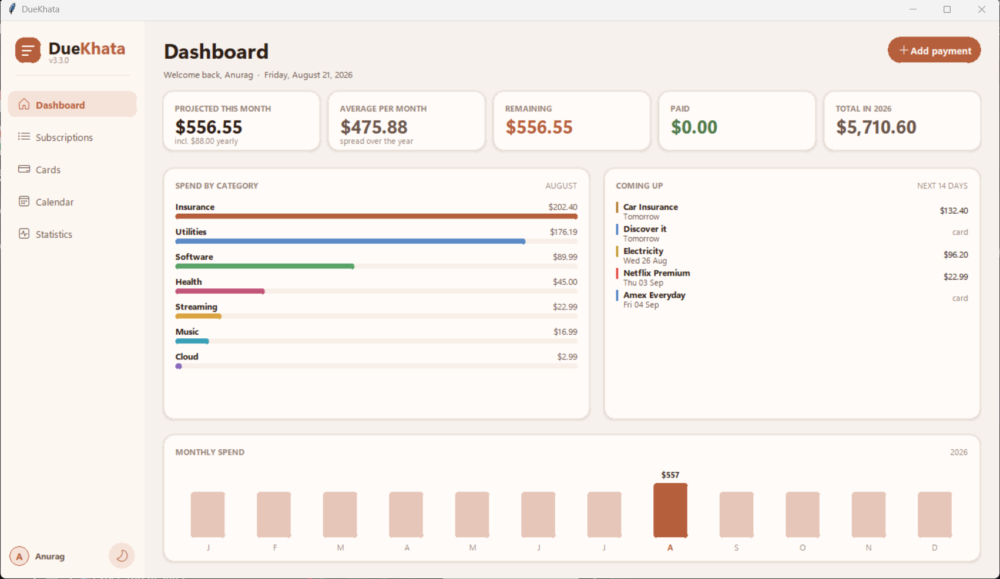

# DueKhata

A Windows desktop application for keeping track of recurring subscriptions and monthly bills. It
shows what is due, what has been paid, and what is still to leave your account this month.

Everything is stored locally. There is no account, no server, and no network access of any kind.



## Download

**[Download the latest release](https://github.com/paudel01anurag/duekhata/releases/latest)**
— take the ZIP under *Assets*, not the green `Code` button, which gives you the source rather than
the application.

There is no installer. Extract the ZIP and run the executable; deleting it removes the application
completely. Installation notes, including the SmartScreen warning that appears on first run, are in
[TESTERS.txt](TESTERS.txt).

## Features

- Four views: a dashboard, a full subscription list, a month calendar, and spending statistics
- Five billing rhythms: one-off, weekly, monthly, quarterly and yearly
- A start date and an optional end date, so cancelled subscriptions leave your forecast
- Running totals for the month: projected, remaining, and paid
- Payments marked as paid per month, so last month's record survives into the next
- Editing that preserves payment history
- Grouping by account and category, with the calendar filterable by account
- Warm light and dark themes
- A local username and password gate

## How repeat dates are worked out

The stored date is the first billing date and the end date, if set, is the last. A subscription
never appears before it started or after it ended.

Billing days are clamped to short months, so a payment due on the 31st falls on 28 February. A
month's total counts every billing day that falls within it, so a weekly subscription counts four or
five times rather than once.

## Requirements

Only needed to run from source. The released build bundles everything.

- Python 3.10 or newer
- `tkcalendar`
- Tkinter, normally included with Python on Windows

```bash
python -m pip install -r requirements.txt
python main.py
```

## Data storage

Subscriptions and payment records live in a SQLite database created on first run:

```text
%LOCALAPPDATA%\DueKhata\expenses.db
```

Never in the application folder, so replacing the executable with a newer version leaves your data
untouched. There is **no backup or export yet** — treat that database as the only copy.

## Tests

```bash
python -m unittest discover -s tests
```

Thirty tests covering the recurrence rules, month and category totals, paid tracking, editing, and
the schema migration from older databases.

## Building

```powershell
python -m pip install -r requirements-build.txt
.\build_windows.ps1
```

`APP_VERSION` in `main.py` is the single source of truth for the version; the build script reads it
to name the archive. The executable is written to `dist\`, and the distributable ZIP to
`dist\archive\`.

## What this is not

A personal project shared openly, rather than a finished product.

- **No backups or export.** Everything is in one file.
- **The login is a latch, not a lock.** Passwords are hashed with PBKDF2-HMAC-SHA256, but the
  database itself is not encrypted, and the recovery option resets the password without proving
  identity. It keeps a casual passer-by out; it does not protect the data.
- **Windows only**, and amounts are in dollars.

## Project layout

| Path | Contents |
|---|---|
| `main.py` | User interface: design tokens, custom widgets, the four views and three windows |
| `expense_tracker.py` | Data model, recurrence engine, and SQLite access. No interface code |
| `tests/` | Unit tests for `expense_tracker.py` |
| `build_windows.ps1` | Builds the executable and the distributable ZIP |
| `TESTERS.txt` | Installation notes, bundled into the ZIP as `READ ME FIRST.txt` |
| `CHANGELOG.md` | What changed in each version |

## Version history

See [CHANGELOG.md](CHANGELOG.md) for what changed in each version, and the
[releases page](https://github.com/paudel01anurag/duekhata/releases) to download any
earlier build.
